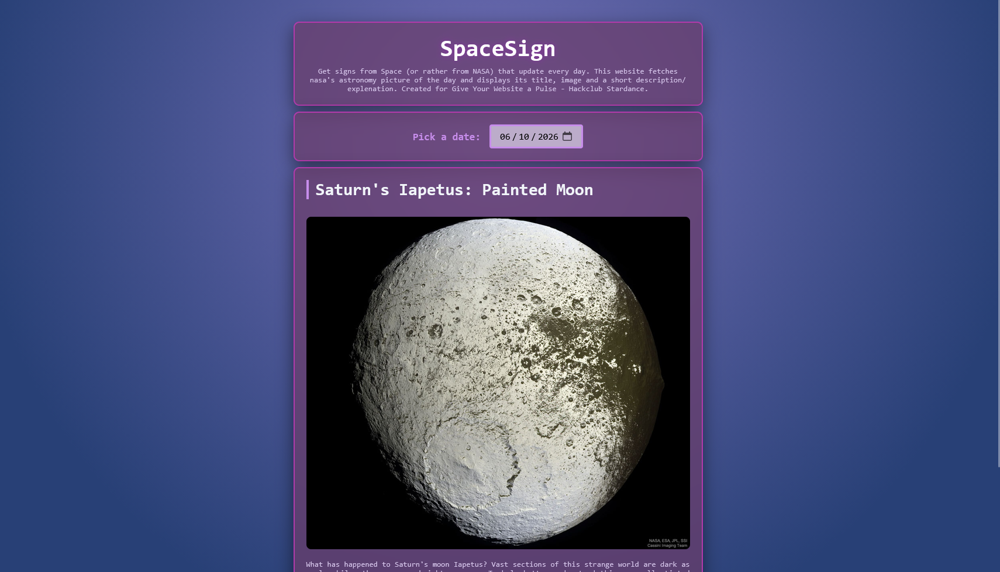
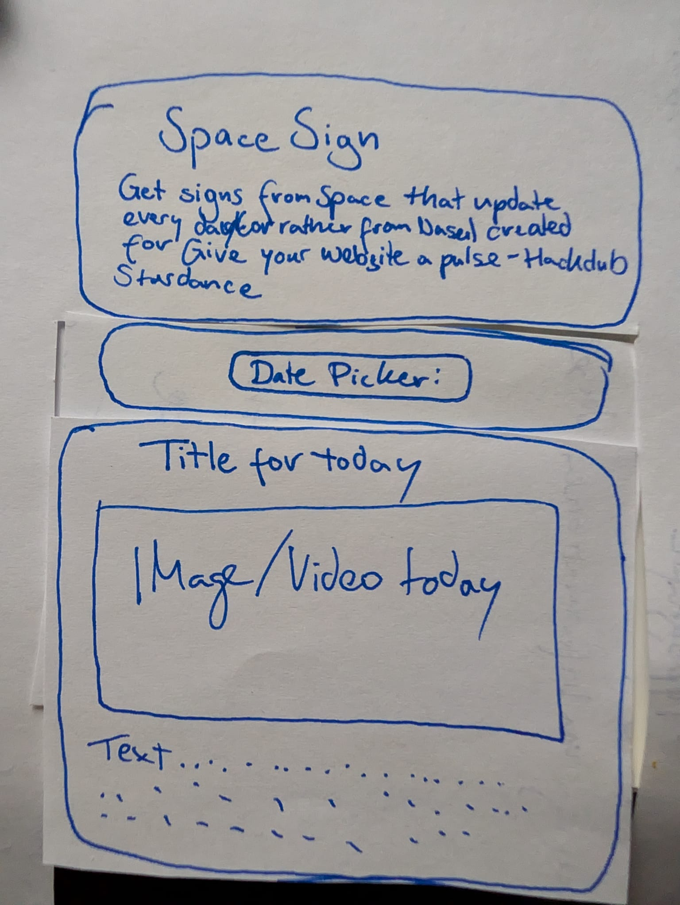

# SpaceSign
Get signs from Space (or rather from NASA) that update every day. This website fetches nasa's astronomy picture of the day and displays its title, image and a short description/explenation.

Other than the guide, you can select previous dates to get the information about previous days. Also the .css styling is different to the guide because I wanted to try out some .css styling that I learned from doing the WebOS Mission. - What I noticed: Its sooo much faster to properly get a sketch of how you want to get the layout then doing it on the go. 

Created for Give Your Website a Pulse - Hackclub Stardance mission. 